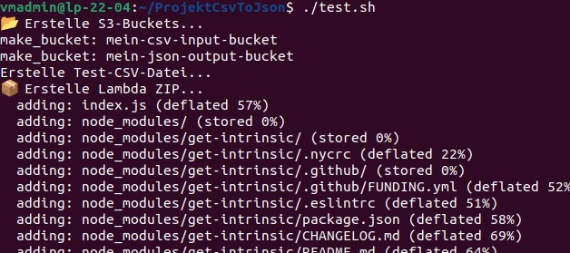
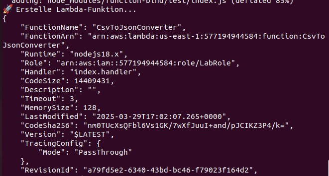
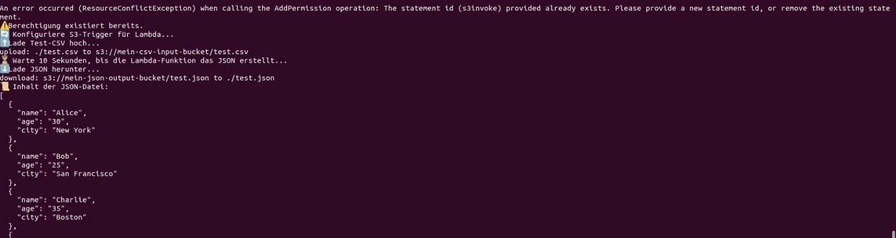
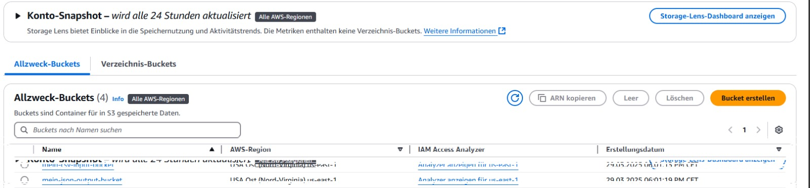
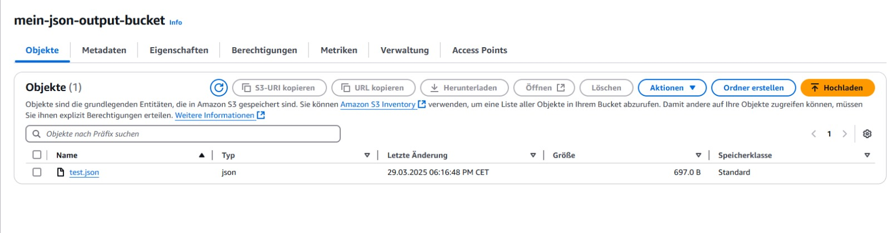

# Csv2Json-Service Dokumentation

## 1. Einführung

### 1.1 Projektziel
Es ist Ziel dieses Projekts, einen Cloud-Service zur Verfügung zu stellen, der CSV-Dateien in JSON-Dateien konventiert. Der Service nutzt AWS S3-Buckets und AWS Lambda-Funktionen und wird vollständig im AWS Learner-Lab bereitgestellt.

### 1.2 Technische Anforderungen
- **CSV zu JSON Konvertierung:** Wenn man eine CSV Datei ins Bucket hochlade wird sie in JSON konventiert
- **Automatisierte Bereitstellung:** Bereitstellung über ein CLI-Script.
- **Versionierung:** Versionisierung durch Github

### 1.3 Aufgabenteigung
Bash script erstellen: Stefan 80% Burim 20%
Javascript Funktion zum Conventieren machen: Stefan 80% Burim 20%
Bug Fixes: Ken 90% Burim 10%
Dokumentation Ken 30% Burim 70%

---

## 2. Systemübersicht

### 2.1 Architektur
- **AWS S3 Buckets:** Ein Input-Bucket für CSV-Dateien und ein Output-Bucket für die JSON-Dateien.
- **AWS Lambda:** wird aktiviert wenn man eine CSV-Datei im input bucket hochläd.
- **Versionierung:** versionsverlauf in Github.

### 2.2 Ablauf der Konvertierung
Der Benutzer lädt eine CSV-Datei in das Input-Bucket hoch was wiederum eine AWS Lambda-Funktion aus, die die Datei konvertiert und die JSON-Datei im Output-Bucket speichert.

---

## 3. Inbetriebnahme

### 3.1 Vorbereitung
Wir brauchen Ein Aws Konto und müssen sichergehen ob die Architektur sicher konfiguriert ist

### 3.2 Installation
um die AWS Komponente zu instalieren nussten wir ```./init.sh``` instalieren.

Was macht dieses Skript?

---


### **Variablen definieren**
```bash
#!/bin/bash

set -e  # Beendet das Skript bei einem Fehler

# AWS Account ID abrufen
ACCOUNT_ID=$(aws sts get-caller-identity --query "Account" --output text)
if [ -z "$ACCOUNT_ID" ]; then
  echo "❌ Fehler: AWS Account ID konnte nicht abgerufen werden!"
  exit 1
fi

# AWS Variablen
INPUT_BUCKET="mein-csv-input-bucket"
OUTPUT_BUCKET="mein-json-output-bucket"
LAMBDA_NAME="CsvToJsonConverter"
LAMBDA_ROLE_ARN="arn:aws:iam::$ACCOUNT_ID:role/LabRole"
REGION="us-east-1"
```
- Speichert folgende werte:
  - **Account-ID** (AWS-Konto)
  - **IAM-Rolle** für Lambda
  - **AWS-Region**
  - **Namen der S3-Buckets**
  - **Lambda-Funktionsname**

---

### **S3-Buckets erstellen**
```bash
echo "📂 Erstelle S3-Buckets..."
aws s3 mb s3://$INPUT_BUCKET || echo "⚠️ Bucket $INPUT_BUCKET existiert bereits."
aws s3 mb s3://$OUTPUT_BUCKET || echo "⚠️ Bucket $OUTPUT_BUCKET existiert bereits."
```
erstellt ein Bucket für Output und einen für input.  
Falls diese schon gibt, wird eine Warnung ausgegeben

---

### **Test-CSV-Datei erstellen**
```bash
TEST_CSV="test.csv"
echo "Erstelle Test-CSV-Datei..."
echo -e "name,age,city\nAlice,30,New York\nBob,25,San Francisco\nCharlie,35,Boston\nDavid,40,Los Angeles\nEva,22,Chicago\nFrank,29,Miami\nGrace,31,Seattle\nHannah,28,Austin\nIvy,24,Denver\nJack,26,Washington" > $TEST_CSV
```
Erstellt eine CSV-Datei als Test

---

### **Lambda ZIP-Datei erstellen**
```bash
echo "📦 Erstelle Lambda ZIP..."
zip -r lambda.zip index.js node_modules
```
Zippt den Lambda-Code und die Node-Module.

---

### **Lambda-Funktion erstellen oder aktualisieren**
```bash
# Prüfen, ob die Lambda-Funktion existiert
EXISTING_LAMBDA=$(aws lambda get-function --function-name $LAMBDA_NAME 2>/dev/null || echo "")

if [ -z "$EXISTING_LAMBDA" ]; then
    echo "🚀 Erstelle Lambda-Funktion..."
    aws lambda create-function --function-name $LAMBDA_NAME \
    --runtime nodejs18.x \
    --role $LAMBDA_ROLE_ARN \
    --handler index.handler \
    --zip-file fileb://lambda.zip \
    --region $REGION
else
    echo "⚠️ Lambda-Funktion existiert bereits – aktualisiere Code..."
    aws lambda update-function-code --function-name $LAMBDA_NAME --zip-file fileb://lambda.zip
fi
```
Die Lambda-Funktion wird je nach dem, ob es sie schon gibt, aktualisiert oder erstellt

### **Lambda-Funktion für S3-Trigger berechtigen**
```bash
echo "🔑 Prüfe und füge Lambda-Berechtigungen hinzu..."
aws lambda add-permission --function-name $LAMBDA_NAME \
--statement-id s3invoke \
--action lambda:InvokeFunction \
--principal s3.amazonaws.com \
--source-arn arn:aws:s3:::$INPUT_BUCKET || echo "⚠️ Berechtigung existiert bereits."
```
Der Bucket bekommt hier die Berechtigung, die Lambda-Funktion auszulösen.

---

### **S3-Trigger für Lambda konfigurieren**
```bash
echo "🔄 Konfiguriere S3-Trigger für Lambda..."
aws s3api put-bucket-notification-configuration --bucket $INPUT_BUCKET \
--notification-configuration "{
     \"LambdaFunctionConfigurations\": [
        {
            \"LambdaFunctionArn\": \"arn:aws:lambda:$REGION:$ACCOUNT_ID:function:$LAMBDA_NAME\",
            \"Events\": [\"s3:ObjectCreated:*\"] 
        }
    ]
}" || echo "⚠️ Fehler beim Konfigurieren der S3-Notification."
```
Sorgt dafür, dass die Lambda-Funktion ausgelöst wird, wenn eine Datei hochgeladen wird.

---

### **Test-CSV-Datei hochladen**
```bash
echo "⬆️ Lade Test-CSV hoch..."
aws s3 cp $TEST_CSV s3://$INPUT_BUCKET/
```
Lädt die Test-CSV in den Input-Bucket hoch.

---

### **Warten auf die JSON-Datei**
```bash
echo "⏳ Warte 10 Sekunden, bis die Lambda-Funktion das JSON erstellt..."
sleep 10
```
Wartet, bis die Lambda-Funktion das JSON erstellt.

---

### **JSON-Datei herunterladen und anzeigen**
```bash
echo "⬇️ Lade JSON herunter..."
aws s3 cp s3://$OUTPUT_BUCKET/test.json test.json || echo "⚠️ JSON-Datei nicht gefunden."

echo "📜 Inhalt der JSON-Datei:"
cat test.json || echo "⚠️ Fehler: JSON konnte nicht gelesen werden."
```
Lädt die JSON-Datei herunter und zeigt deren Inhalt an.

---

### **Fertig!**
```bash
echo "✅ Fertig!"
```
Das Skript ist abgeschlossen.

---

## 4. Git-Repository

### 4.1 Struktur des Repositories


| **Dateiname**         | **Beschreibung** |
|----------------------|----------------|
| `node_modules/`      | Enthält installierte Node.js-Abhängigkeiten. |
| `Dokumentation.md`   | Dokumentation des Projekts.|
| `README.md`         | Allgemeine Projektbeschreibung mit Nutzungshinweisen. |
| `index.js`          | Extrahier und C¨Konventiert die CSV Datei |
| `init.sh`          | Shell-Skript zur Automatisierung aller prozesse. |
| `lambda.zip`       | Bereitstellung einer AWS Lambda-Funktion. |
| `package-lock.json` | Bildet die instalierte npm-Pakete ab. |
| `package.json`      | Enthält Metadaten. |
| `test.csv`         | Testdatei im CSV-Format. |
| `test.json`        | Testdatei im JSON-Format. |


---

## 5. Test und Protokollierung

### 5.1 Testfälle
Der Test stellt stellt sicher das CSV Dateien Wirklich in JSON Konventiert werden

### 5.2 Testprotokolle und Screenshots



Man sieht das die Buckets erstellt wurden dank der Konsolen ausgabe.



Die Lambdafunktion wurde korrekt erstellt.



Csv wurde hochgeladen und json korrekt runtergeladen und angezeigt.



Buckets in s3



Fertige test.json datei

---

## 6. Konvertierungsfunktion

### 6.1 Funktionsweise der Konvertierung
Die Konventierung wird von einer Javascript Datei `Index.js` durchgeführt.

#### `Index.js`
```js
/**
 * CSV to JSON Converter (AWS Lambda)
 * -----------------------------------
 * Konvertiert eine hochgeladene CSV-Datei aus einem S3-Bucket in eine JSON-Datei
 * und speichert diese in einem anderen S3-Bucket.
 * 
 * Autor: Stefan, Burim und Ken
 * Quellen: 
 * - AWS SDK: https://docs.aws.amazon.com/AWSJavaScriptSDK/latest/AWS/S3.html
 * - csv-parser: https://www.npmjs.com/package/csv-parser
 */

const AWS = require('aws-sdk');
const s3 = new AWS.S3();
const csv = require('csv-parser');
const stream = require('stream');

const DELIMITER = ','; // Anpassbar: ';' oder '\t' für Tab

exports.handler = async (event) => {
    try {
        // Extrahiere Bucket- und Datei-Info aus Event
        const bucketName = event.Records[0].s3.bucket.name;
        const fileKey = event.Records[0].s3.object.key;
        const outputBucket = 'mein-json-output-bucket';
        const outputKey = fileKey.replace('.csv', '.json');

        console.log(`📥 CSV-Datei empfangen: Bucket=${bucketName}, Datei=${fileKey}`);

        // Lade die CSV-Datei aus dem S3-Bucket
        const csvData = await s3.getObject({ Bucket: bucketName, Key: fileKey }).promise();
        if (!csvData.Body) {
            throw new Error("⚠️ Fehler: CSV-Datei konnte nicht geladen werden oder ist leer.");
        }

        // Konvertiere CSV in JSON
        const jsonData = await parseCsv(csvData.Body);
        const formattedJsonData = JSON.stringify(jsonData, null, 2);

        console.log('✅ Konvertierte JSON-Daten:', formattedJsonData);

        // Lade die JSON-Datei in den Output-Bucket hoch
        await s3.putObject({
            Bucket: outputBucket,
            Key: outputKey,
            Body: formattedJsonData,
            ContentType: 'application/json'
        }).promise();

        console.log(`✅ Erfolgreich gespeichert: ${outputKey} in ${outputBucket}`);
    } catch (error) {
        console.error('❌ Fehler:', error);
    }
};

/**
 * Konvertiert einen CSV-Buffer in ein JSON-Array.
 * @param {Buffer} csvBuffer - Der Inhalt der CSV-Datei
 * @returns {Promise<Array>} JSON-Array der Daten
 */
function parseCsv(csvBuffer) {
    return new Promise((resolve, reject) => {
        const results = [];
        const readable = new stream.Readable();
        readable._read = () => {}; // Keine neue Datenquelle nötig
        readable.push(csvBuffer);
        readable.push(null); // Stream-Ende signalisieren

        readable
            .pipe(csv({ separator: DELIMITER })) // Nutzt die Variable DELIMITER
            .on('data', (data) => results.push(data))
            .on('end', () => resolve(results))
            .on('error', reject);
    });
}
```

#### Beispiel für eine CSV-Datei:
```csv
name,age,city
Alice,30,New York
Bob,25,San Francisco
Charlie,35,Boston
David,40,Los Angeles
Eva,22,Chicago
Frank,29,Miami
Grace,31,Seattle
Hannah,28,Austin
Ivy,24,Denver
Jack,26,Washington
```

#### Beispiel für das JSON-Ergebnis:
```json
[
  {
    "name": "Alice",
    "age": "30",
    "city": "New York"
  },
  {
    "name": "Bob",
    "age": "25",
    "city": "San Francisco"
  },
  {
    "name": "Charlie",
    "age": "35",
    "city": "Boston"
  },
  {
    "name": "David",
    "age": "40",
    "city": "Los Angeles"
  },
  {
    "name": "Eva",
    "age": "22",
    "city": "Chicago"
  },
  {
    "name": "Frank",
    "age": "29",
    "city": "Miami"
  },
  {
    "name": "Grace",
    "age": "31",
    "city": "Seattle"
  },
  {
    "name": "Hannah",
    "age": "28",
    "city": "Austin"
  },
  {
    "name": "Ivy",
    "age": "24",
    "city": "Denver"
  },
  {
    "name": "Jack",
    "age": "26",
    "city": "Washington"
  }
]

```

---

## 7. Automatisierung

### 7.1 Automatisierungs-Skripte
- **init.sh:** Installiert alle benötigten AWS-Komponenten.
- **test.sh:** Lädt automatisch eine CSV-Datei hoch und überprüft die Konvertierung.


---

## 8. Reflexion
### Ken
Da ich in den Blöcken in denen wir dieses Projekt gamacht haben krank war konnte habe ich hauptzächlich ausserhalb der Schulzeit daran gearbeitet. Jedoch konnte ich beim zweiten Block mithelfen per Teams-call. Ich habe hauptzächlich beim Bugfixen geholfen per pair programming (entweder durch shared screen in Teams oder durch's physisched mitschauen) und die jeweiligen Tests überprüft. Ich habe daher imernoch mein bestes versucht hilfreich zu sein und beim Projekt etwas beizutragen. Zu de Habe ich mit Burim An der Dokumentation gearbeitet.

### Stefan
Ich denke, wir haben einen ziemlich guten Job gemacht. Wir sind mit allem fertig geworden, und das Skript sowie die Lambda-Funktion funktionieren. Unsere Teamarbeit war trotz Ken's Krankheit ziemlich gut. Wir haben Pair Programming gemacht, und das Skript sowie die Java-Funktion sind meiner Meinung nach sehr gut gelungen, wir haben sie gut dokumentiert und strukturiert.

Was ich an mir selbst verbessern möchte, ist, dass ich alles genau anschaue, bevor ich einen Push mache oder sage, dass das Skript funktioniert. Oft entdecke ich später noch Anforderungen, die ich nicht implementiert habe, oder merke beim erneuten Ausführen, dass es doch nicht funktioniert z.b als ich dachte das es funktioniert, es hat aber nur funktioniert weil ich die Lambda-Funktion schn vom letzen mal hatte und sie im Skript gar nicht erstellt wird. Außerdem sollte ich die Aufgaben noch ein bisschen früher erledigen und nicht immer auf den letzten Drücker.

### Burim
Ich habe einer seits Stefan mit dem erstellen des Bash skriptes und der Javascript Funktion geholfen. Und Hauptzächlich an der Dokumentation gearbeitet. An dieser habe ich Inkrimentell im verlaufe der Blöcke gearbeitet. Ken hat mir am schluss wie vereinbart auch mit der Doku geholfen. Wir mussten etwas improvisieren um Ken im Projekt einzubauen jedoch gaube ich wir haben einen guten Job gemacht. Ich habe die Doku sehr unterschätzt und habe deshalb vieles für den schluss aufgehoben. Mitnehmen kann ich das ich die lernziele und den Auftrag selber gut durchlesen muss am Anfeng eines Projektes sodass ich besser eiplanen kann wenn ich was machen muss.

---

## 9. Quellen und Referenzen
- **M346-Projekt-CsvToJson-2025 PDF:** [M346-Projekt-CsvToJson-2025](https://moodle4.ksb-web.ch/pluginfile.php/10076/mod_resource/content/1/M346-Projekt-CsvToJson-2025.pdf)


### 10.1 Bilder
- In der Shell der Ubuntu Maschiene
- Aws Learner Lab
